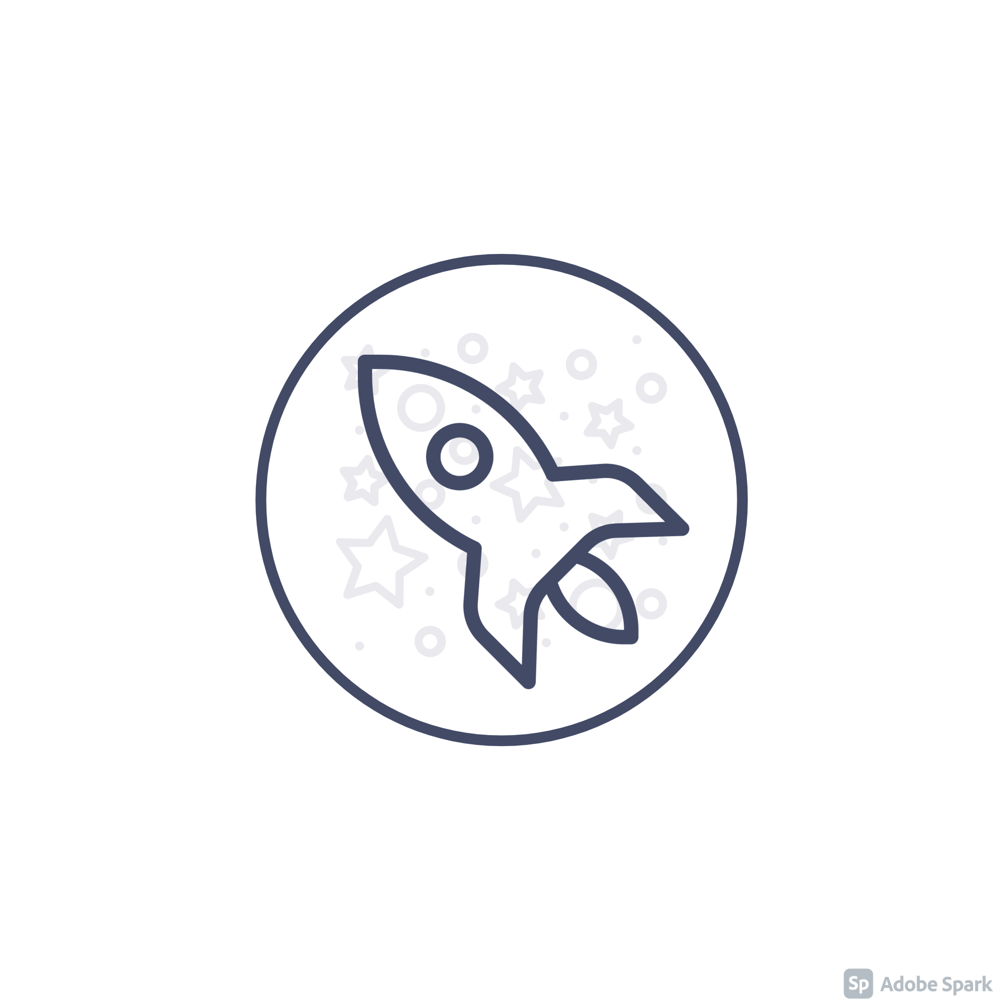
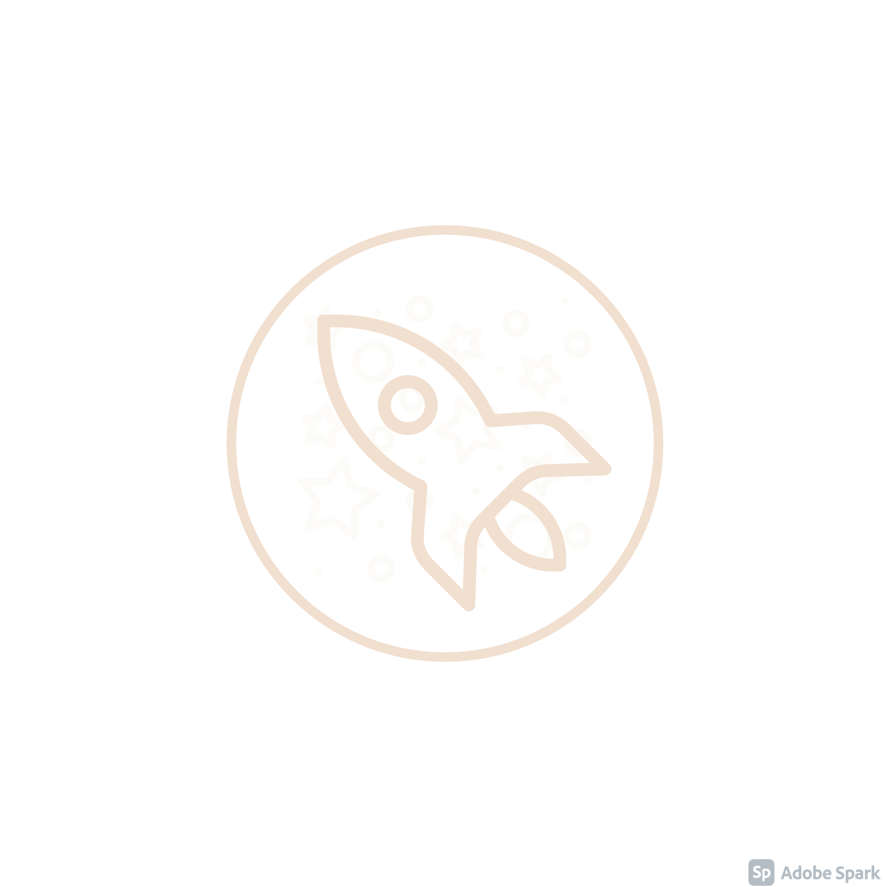

# Voyage

    
     

    
     

   

### Colors:

 <p1>■</p1> #2D3655 <p2>■</p2> #424A66 <s1>■</s1> #6E6B64 <s2>■</s2> #A49D94 <accent>■</accent> #F1DFCF

This is a case study for:
1. Android's [Jetpack](https://developer.android.com/jetpack?gclid=CjwKCAjw7--KBhAMEiwAxfpkWBXrXwunvBWDAlvA7MEPjgEx7sdOEpR1-wYX-JShxNisk70XTgJNxhoCSyYQAvD_BwE&gclsrc=aw.ds) libraries
    1. Compose
    2. Hilt
    3. Room
    4. Paging
    5. Browser
    6. Navigation
    7. Datastore
    8. Constraint Layout
    9. Startup
    10. Window Manager _for foldables devices_
    11. Benchmark

2. Clean Archtacture
3. [MVVM](https://en.wikipedia.org/wiki/Model%E2%80%93view%E2%80%93viewmodel)&[MVI](https://proandroiddev.com/android-model-view-intent-with-kotlin-flow-ca5945316ec)  for presentation logic _-yes, we can use more than one pattern-_
4. Kotlin's Coroutines
5. [Bazel](https://bazel.build/) build system
6. Testing
    1. [MockK](https://github.com/mockk/mockk)
    2. [Truth](https://truth.dev/)

It uses the [Space Flight News Api](https://www.spaceflightnewsapi.net/)

